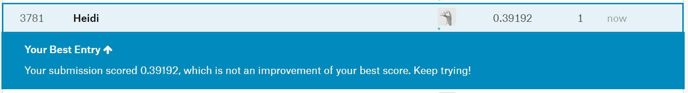

```{r setup, include=FALSE}
# Load all your packages here:
library(tidyverse)
library(scales)

# Set default behavior for all code chunks here:
knitr::opts_chunk$set(
  echo = TRUE, warning = FALSE, message = FALSE,
  fig.width = 16/2, fig.height = 9/2
)

# Set seed value of random number generator here. This is in order to get
# "replicable" randomness, so that any results based on random sampling or
# resampling are replicable everytime you knit this file. Why use a seed value
# of 76? For no other reason than:
# https://www.youtube.com/watch?v=xjJ7FheCkCU
set.seed(76)
```

You will be submiting an entry to Kaggle's [House Prices: Advanced Regression Techniques](https://www.kaggle.com/c/house-prices-advanced-regression-techniques/){target="_blank"} by fitting a **spline** model $\hat{f}(x)$ using a single numerical predictor $x$ of your choice. Note that splines are not a great model to use in practice since they only allow you to use one predictor variable at a time, however they are an excellent vehicle for thinking about the ideas behind crossvalidation.


***


# Data

Read in data provided by Kaggle for this competition. They are organized in the `data/` folder of this RStudio project:

```{r}
training <- read_csv("C:/Users/heidi/OneDrive/Documents/College/Semester 5/CSC 293/MP1/MP1/data/train.csv")
test <- read_csv("C:/Users/heidi/OneDrive/Documents/College/Semester 5/CSC 293/MP1/MP1/data/test.csv")
sample_submission <- read_csv("C:/Users/heidi/OneDrive/Documents/College/Semester 5/CSC 293/MP1/MP1/data/sample_submission.csv")
```

Before performing any model fitting, you should always conduct an **exploratory data analysis** (EDA). This will help guide and inform your model fitting. 


## Look at your data!

Always, ALWAYS, **ALWAYS** start by looking at your raw data. This gives you visual sense of what information you have to help build your predictive models. To get a full description of each variable, read the data dictionary in the `data_description.txt` file in the `data/` folder.

Note that the following code chunk has `eval = FALSE` meaning "don't evaluate this chunk with knitting" because `.Rmd` files won't knit if they include a `View()`:

```{r, eval = FALSE}
View(training)
glimpse(training)

View(test)
glimpse(test)
```

In particular, pay close attention to the variables and variable types in the
`sample_submission.csv`. Your submission must match this exactly.

```{r}
glimpse(sample_submission)
```


## Data wrangling

Do any data wrangling/transforming here:

```{r}

```


## Visualizations

A univariate exploratory visualization of the outcome variable:

```{r}
outcome_var_plot <- ggplot(training, aes(x = SalePrice))+
  geom_histogram()
```

A univariate exploratory visualization of the predictor variable:

```{r}
predic_var_plot <- ggplot(training, aes(x = LotArea)) +
  geom_histogram()

```

A multivariate exploratory visualization of the *relationship* between the outcome and predictor variable.

```{r}
training_plot <- ggplot(training, aes(x = LotArea, y = SalePrice)) +
  geom_point()
training_plot
```


***

# Explore choices of df

This whole section relates to the **due diligence** and the **reaching for the stars** steps of the grading scheme: choosing the degrees of freedom $df$ in a non-arbitrary fashion.

```{r}

```


## Crossvalidation from scratch

Implement crossvalidation from scratch here. In other words, don't use an existing function, but rather program your own. 


https://stats.stackexchange.com/questions/61090/how-to-split-a-data-set-to-do-10-fold-cross-validation
```{r}

#Randomly shuffle the data
set.seed(21)

training<-training[sample(nrow(training)),]

#Create 10 equally size folds
folds <- cut(seq(1,nrow(training)),breaks=10,labels=FALSE)

# list of df we want to try
df_lst <- seq(1,35, by = 1)

#create a list of avg_rmsle_hat values found from differnt df
avg_rmsle_hat_lst <- c()

for (d in df_lst){
  
  #keep a list of RMSLE_hat for this fi
  RMSLE_hat_list <- c()
  
  #Perform 10 fold cross validation
  for(i in 2:10){
    
    
      #Segement your data by fold using the which() function 
      testIndexes <- which(folds==i,arr.ind=TRUE)
      testData <- training[testIndexes, ]
      trainData <- training[-testIndexes, ]
      
      
      #Use the test and train data partitions to cross validate
    
      fitted_spline_model <- smooth.spline(x = trainData$LotArea, y = trainData$SalePrice, df = d)
      
      # Extract data frame of info based on fitted model:
      fitted_spline_model_points <- fitted_spline_model %>%
        broom::augment()
      fitted_spline_model_points
      
      predicted_points <- predict(fitted_spline_model, x = testData$LotArea) %>%
        as_tibble()
  
      testData <- testData %>%
        mutate(SalePrice_hat = predicted_points$y)
  
      RMSLE_hat <- (MLmetrics::RMSLE(y_pred = testData$SalePrice_hat, y_true = testData$SalePrice))
     
      
      #add the new RMSLE_hat to the list of RMSLE_hat values     
      RMSLE_hat_list <- c(RMSLE_hat_list, RMSLE_hat)
      
  }
  
#find the average RMSE and add to avg_rmsle_hat_lst
  avg_rmsle_hat_lst <- c(avg_rmsle_hat_lst, mean(RMSLE_hat_list)) 

}
```


```{r}
#make a dataframe from list of df and rmsle values 
dataf <- data.frame(df = df_lst, RMSLE = avg_rmsle_hat_lst)
```

```{r}
optimal_df_plot <- ggplot(dataf, aes(x = df ,y = RMSLE)) +
  geom_point()
optimal_df_plot

optimal_df <- which.min(avg_rmsle_hat_lst)+1
message(optimal_df)
```


## Visualization justifying your choice of "optimal" df

This subsection relates to the **point of diminishing returns** step of the grading scheme: a visualization like [Lec01 slides \#36](http://rudeboybert.rbind.io/talk/2019-01-13-Williams.pdf#page=36){target="_blank"} justifying your choice of optimal `df^*`. 


***


# Make predictions based on chosen df

Set `df_star` to be the degrees of freedom you'll use to make your predictions, arbitrarily chosen or not.

```{r}
df_star <- 10

```


## Visualize your model on training data

Visualize your fitted splines model $\widehat{f}()$ with degrees of freedom `df_star` on the training data. Recall we can only create this plot for the training data because we only have the outcome variable $y$ for the training data.

```{r}

```


## Make predictions on test data

Make your predictions/get your predicted values $\widehat{y}$ on the test data. 

```{r}

```


***


# Submission

## Create your submission CSV

The following code creates a submission where the predicted sale price for all houses in the test set is just the average sale price of the training data. Change the code so that you are submitted your spline model fitted predictions. 

```{r}
submission <- sample_submission %>% 
  mutate(SalePrice =  mean(training$SalePrice))

write_csv(submission, path = "data/submission.csv")
```

## Screenshot of your Kaggle score

The "Root Mean Squared Logarithmic Error" score based on my example submission was 0.42918. Replace `score_screenshot.png` with a screenshot of your score. 

{ width=100% }


## Comparing your estimated score to your Kaggle score

This section relates to the **reaching for the stars** step of the grading scheme: showing that your estimated $\widehat{\text{RMLSE}}$ you obtained from your implemented crossvalidation scheme is "close" to the real $\text{RMLSE}$ that Kaggle returns on the leaderboard. 


